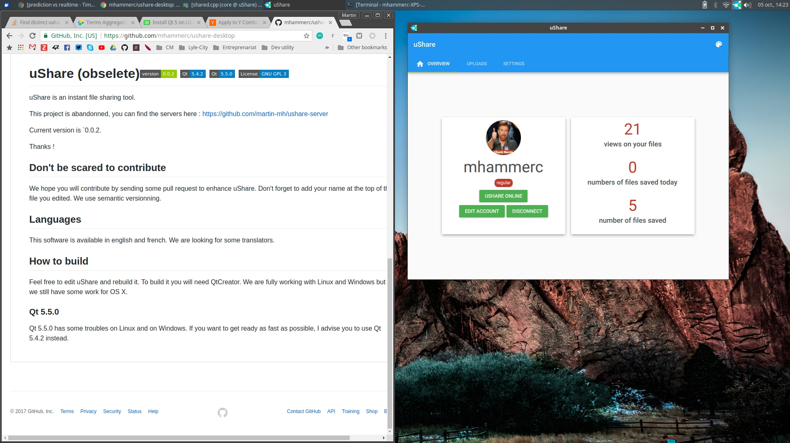
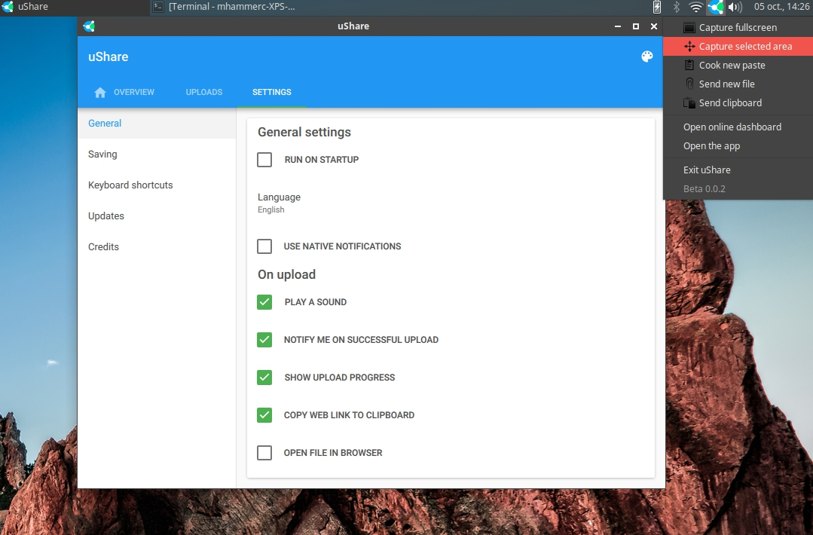
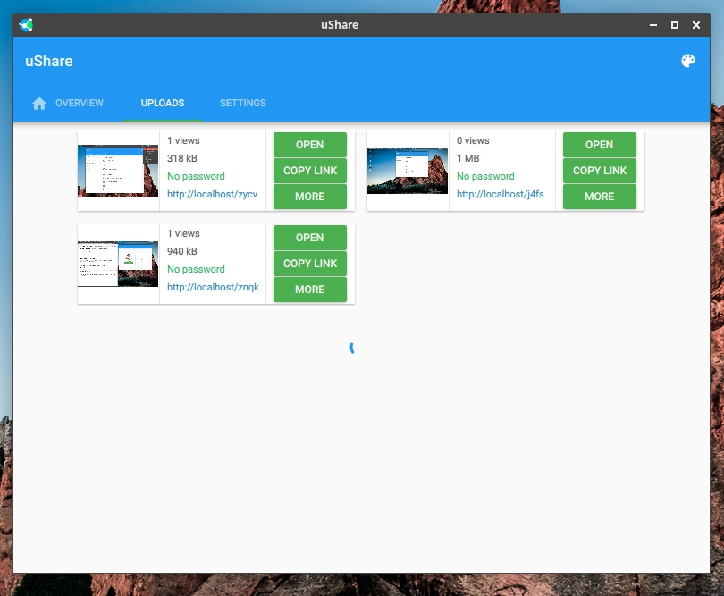

# uShare (obselete)   

uShare is an instant file sharing tool. It allow you to share capture screens, share files and more.

A long time ago, uShare was my fun project to change the way we quickly share files to friends. I was using Qt (with QML) and Node.js.

At the time, it was one of the first desktop app using Material Design.

The app is powered by Ajax to provide realtime data right in the app interface.

You can find the [server here](https://github.com/martin-mh/ushare-server).

Obviously, the following screens were taken from uShare itself.

